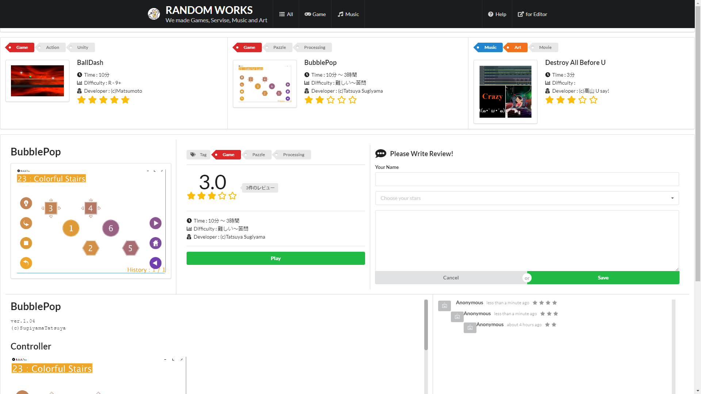
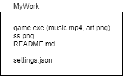

# Flat Launcher

## for Developer

- 作品は一つのディレクトリにまとめてください
- 新たに「settings.json」を同一階層に作成してください
- 日本語を使用する際は「utf-8」に設定してください

## settings.json
> jsonには以下の項目を入力してください

 - [ ] name : 作品の表示名
 - [ ] tags : 作品のタグ
 - [ ] developer : 開発者の名前
 - [ ] snapshot : スクリーンショット
 - [ ] readme : 作品の説明, markdown対応
 - [ ] exec : 実行ファイルのパス
 - [ ] time : 想定される時間
 - [ ] difficulty : ゲームなどは難しさを設定

## Tags
> タグの項目のフォーマット

"Game Action Steam Test"

↓

"Game", "Action", "Steam", "Test"

> 単語が半角スペースで区切られ、それぞれがタグとして追加されます。

作品の検索フィルターにヒットするタグ
  - Game
  - Music
  - Art
  - Service

## Resources
> 現在のファイル構成

  - works（作品群）
    - 2018yuko
      - SampleDir（作品のディレクトリ）
        - settings.json

- - -
settings.json（例）

        {
          "name" : "NewActionGame",
          "tags" : "Game Action Unity Android",
          "developer" : "(c)Taro Yamada",
          "snapshot" : "ss.jpg",
          "time" : "20分 ～ 3 時間",
          "difficulty" : "難しい",
          "readme" : "README.md",
          "exec" : "game.exe"
        }
